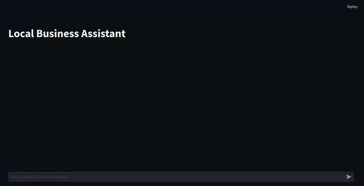

# Enhancing Local Business Intelligence: Beyond Google Map

This is a Streamlit app that uses a large language model from ollama to assist with local business queries. It connects to a local API endpoint and provides responses based on the user's input.

## Table of Contents
- [Architecture](#architecture)
- [Key Features](#key-features)
- [Installation](#installation)
- [Datasets](#datasets)
- [Ollama model](#ollama-model)
- [Initialize Backend](#initialize-backend)
- [Run the App](#run-the-app)
- [Demo](#demo)
- [RAFT](#raft)
- [TODO](#todo)
- [Blog](#blog)
  

## Architecture

- FastAPI Backend: Handles data processing, retrieval, and integration with the LLM.
- Vector Store: Utilizes Chroma DB for efficient similarity search.
- Embedding Model: Employs HuggingFace's BAAI/bge-small-en-v1.5 for text embeddings.
- Large Language Model: Uses a fine-tuned LLaMA3-8B model for natural language understanding and generation.
- Image Embedding and Matching: Incorporates image-based search for enhanced recommendations using CLIP's features.
- Streamlit Frontend: Provides an intuitive user interface for interacting with the system.
  <br>
  

## Key Features

1. **Personalized Recommendations**
   - The system takes into account the user's past reviews and preferences when generating recommendations.
   - This personalization is achieved by:
     - Storing and retrieving user-specific review data
     - Incorporating user reviews into the context provided to the LLM

2. **Multi-modal Search**
   - Our system goes beyond text-based search by incorporating image data:
     - Stores and retrieves business images
     - Performs image-text matching to find visually relevant results
     - Presents top matching images alongside text recommendations

3. **Conversational Interface**
   - The Streamlit frontend provides a chat-like interface, allowing users to:
     - Ask natural language queries
     - Receive detailed responses from the LLM
     - View relevant images and business details
     - Engage in follow-up questions for deeper exploration

4. **Efficient Data Retrieval**
    - The system employs vector search techniques for fast and accurate retrieval:
     - Uses Chroma DB as a vector store for both text and image embeddings
     - Implements semantic search using the BAAI/bge-small-en-v1.5 embedding model
    - The system uses CLIP embedding with chromdb for image retrievals.

## Installation

To run this app, you need to have Python and Streamlit installed on your machine. You can install the required packages using pip:

```bash
pip install -r requirements.txt
```

## Datasets

Download the datasets from [google-local-dataset](https://datarepo.eng.ucsd.edu/mcauley_group/gdrive/googlelocal/#subsets) and save it inside the datasets directory.

## Ollama model

- You can use the model directly for inference if it fits the system otherwise you have to use [unsloth](https://github.com/unslothai/unsloth) model conversion to convert it to GGUF format.
- you can use the following code from unsloth to convert it to the GGUF model with q4_k_m quantization.
```python
from unsloth import FastLanguageModel
model, tokenizer = FastLanguageModel.from_pretrained("../checkpoint_xx")
model.save_pretrained_gguf("gguf_model", tokenizer, quantization_method = "q4_k_m")
```
Convert the [finetuned model]((https://drive.google.com/drive/folders/1VGyEen8RjsoP-OJL6MowOqUuWIkNQH7i)) from [finetuning notebook](notebooks/finetuning_notebook.ipynb) to ollama using the fllowing command

```bash
ollama ollama create gmap_recomm_llama3 -f ./gguf_model/Modelfile
```

> [!NOTE]
> Update the path of the file in [Modelfile](https://drive.google.com/drive/folders/1VGyEen8RjsoP-OJL6MowOqUuWIkNQH7i)

## Initialize Backend

```bash
python fast_api.py
```

## Run the App

```bash
streamlit run streamlit_demo.py
```

## Demo



*Demo of the Local Business Assistant in action*

## RAFT
RAFT is a recipe to adapting LLMs to domain-specific RAG. For information about the RAFT technique, please refer to the README file in the `raft` directory.

## TODO

- [x] Improve error handling and user feedback
- [x] Optimize database queries for faster responses
- [x] Implement caching mechanism for frequent queries
- [x] Generate RAFT dataset using llama3 
- [x] Finetune the llama3/local LLM on the new dataset created 
- [ ] Replace chromaDB retriever with BM25 from llama-index(package installation issue)
- [ ] Add unit tests for backend functions
- [ ] Integrate with more data sources for comprehensive information
- [ ] Implement a feedback system for users to rate responses

## Blog
The content is also explained briefly in my [blog post](https://www.hackster.io/r-bot/enhancing-local-business-intelligence-beyond-google-map-46939f)

